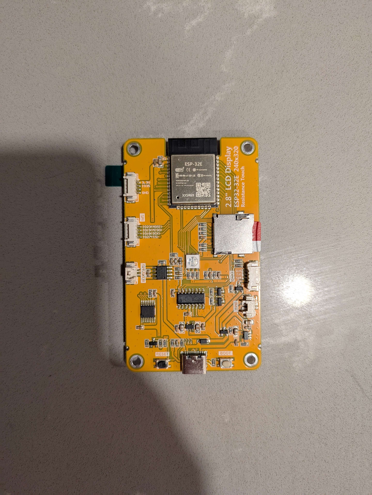
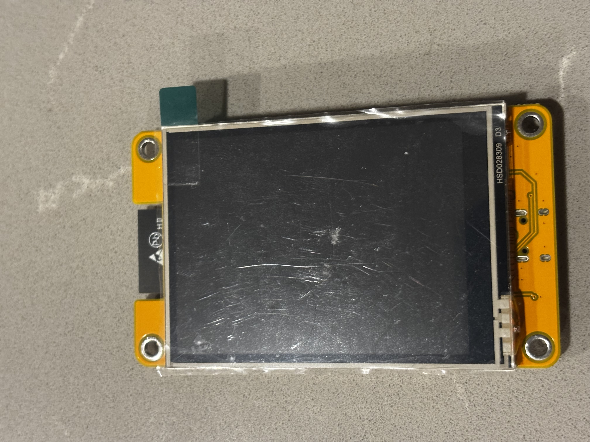

# CYD Identification guide

Here you will find a list of CYD boards with images to assist in identification. If your board is not listed here please join the discord community or open an PR and we'd be happy to include it

---

## Fake CYD ESP32-2432S024R

Compatible firmware package: `CYDDualUSB.zip`

Identifying features:

- Single type C port
- centered RGB LED
- boot/reset buttons next to usb port

---
